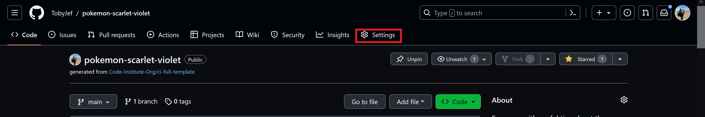
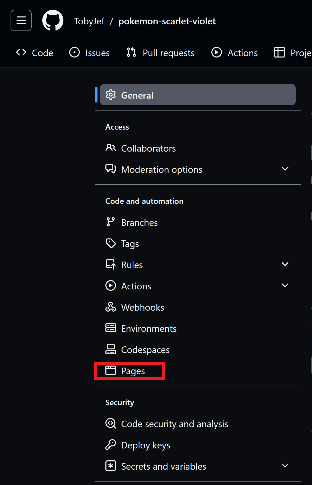
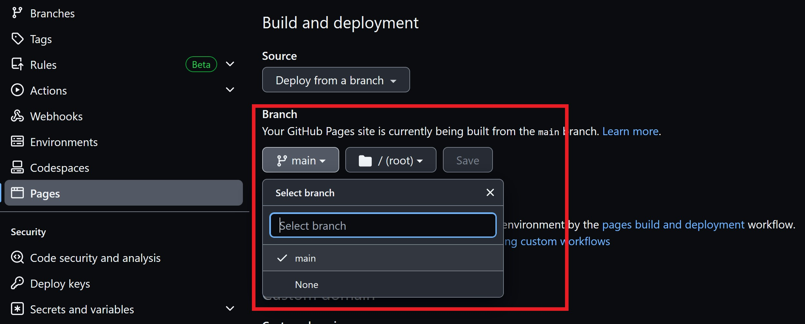
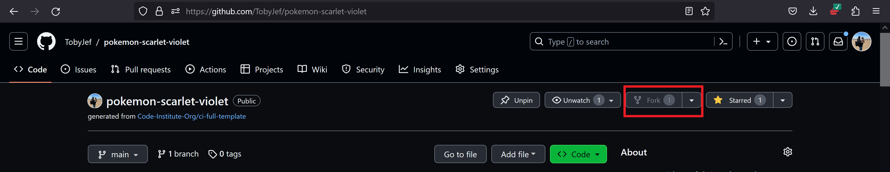
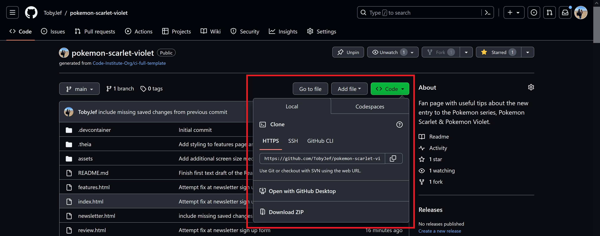
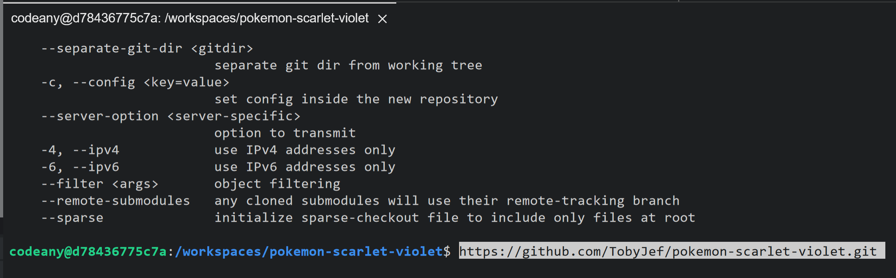

# POKEVIEWS

## A Pokemon Scarlet and Pokemon Violet Fan Review

Welcome to Pokeviews,

This website is a fan review of Pokemon Scarlet and Pokemon Violet. This page is for fans of the Pokemon franchise, and casual fans of the Pokemon video game, who may not have kept up to date with all the latest releases. This site aims to provide a space to read my honest review on the latest games release, also strategies on the limited time raid events for the Mightiest Mark Pokemon that are unable to obtain otherwise in the base game.

We also provide the opportunity for the our readers to sign up to the Pokeviews newletter by submitting their Email Address and Trainer IDs. To receive updates on the games and new mystery gift codes, this rewards players who submit these codes before the expiry date with gifts ranging from items to event Pokemon.

A link to the live website can be found here:
[Link to the Pokeviews website](https://tobyjef.github.io/pokemon-scarlet-violet/)

# Site Overview and Features

## Navigation Bar

Underneath the site name, sits the navigation bar this directs users to the Home page, New Features page, Review page and Newsletter page.

Users can also click on the Pokeviews name within the site logo to re-direct them back to the Home page.

The navigation bar is styled in firebrick red. This colour was chosen to represent Pokemon Scarlet, the site links have been given white text and being set against the darker background helps give the navigation bar visual contrast and accessibility.

![Pokeviews Homepage]url('assets/images/documentation/nav-bar.webp')

## Home Page

The opening of our home page begins with the sites hero image of the two legendary Pokemon from the Generation Nine games, Koraidon and Miraidon. Koraidon is exclusively found in Pokemon Scarlet and Miraidon is exclusive to Pokemon Violet.  

Below there is a short welcome message to visitors of the Pokeviews website, and a short section containing a site preview statement on what the reader is to expect from visiting the Pokeviews website, and our and what can be found within each page from the navigation bar. Finally found on the Pokeviews landing page is an embedded Youtube video from Pokemon UK Youtube channel of the final advertisement gameplay trailer before the games release date.

[Pokemon UK Youtube channel](https://www.youtube.com/@pokemon/videos/).

## New Features

The New Features page is dedicated to giving readers a quick description of the new features added within Pokemon Scarlet/Violet or features improved upon from previous Pokemon Games.

Due to the nature of the content, it would of been a possibility that the content provided contained spoilers to those who have yet to play the game. So specific details have been spared for the benefit of those readers, and the information within the article is content that had been already shown or discussed in promotional material.

## Review

The Review page is a space for users to read an overall honest and unbiased review of the game and it's content. Good and bad points and what could of been done differently.

## Newsletter

Within the Newsletter page, there is a mix of content that can be found here. From the sign up form for the newsletter, a strategy on how to defeat the Tera raid, which is to be updated as and when new raids take place. A table showing previous raids and a short preview of the upcoming additional paid content followed by the promotional trailer.

## Footer

The footer was given the Blue Violet CSS styling to represent the colour scheme of Pokemon Violet. The site links have been given white text and being set against the darker background helps give the footer visual contrast and accessibility.

Included within the footer are social media links for Facebook, Twitter, Instagram and also Youtube.

# Site Design

Although the Pokeviews website was solely written by myself, the site was purposely written in a style to give the sense to the reader that there is a team of individuals that help contribute content to the website.

The body of the site has been given an overall base background colour of #282828, a lighter black/darker grey. This is to help accomodate the white text of the Pokeviews name, and also the Firebrick red nav-bar and Blue Violet footer to make these features standout.

As mentioned within the Site Overview and Features section, Firebrick red and Blue Violet colours were chosen to represent the given colours of the games themselves.

The newsletter sign up form was given a Teal background to represent the first part of the additional paid content, The Teal Mask.

The articles found within the Pokeviews site have all been given the same background colour of rgba(255, 255, 255, 0.8), that sit ontop of the site body lighter black/darker grey background colour. The article design was created in a way that gives the sites content a more centralised aspect and space between sections. The theming of the articles have been carried across all pages on the site.

The accompanying images that sit either alongside or underneath the text of the articles were placed with consideration of the reader and flow of the articles.

On larger screens the Exclusive Pokemon content text and image has been split to share the screen to accomodate the image height which shows the Pokemon exclusive to each game.

On smaller screens, some images have had to be repositioned from there orignal placement or removed completely due to the images original size.

CSS and media query design for Pokeviews was carried out using the Developer tools on the Firefox browser.

# Future Improvements

It would be my intention that the pokeviews website would continue to be updated with additional and revised content. I would plan to add a review of both parts of the additional paid content for the game once they have been released and then completed by myself.
With a view to then redesign and adapt the website whenever the next generation Pokemon game is announced/released.

I would also like to include an image, wether that image is found or created to sit alongside the Pokeviews site name to help create and build upon the Pokeviews brand.

There are a few images that have been excluded from some of the smaller pixel media queries, due to those images original sizes. That I would like to recapture at a smaller size so they could be re-sized and included for small screens.

Also there would be a plan to create a social media presence that readers would be directed to via the links in the footer, to give fans of the Pokeviews site a chance to connect and interact with one another and also myself.

Aim to improve Google Lighthouse scores on Home and Newsletter pages.

# Technologies Used

- HTML

- CSS

# Testing

## W3C Markup Validation Service

- No issues found across all pages.

## W3C CSS Validation Service

- No issues found.

## Google Developer tools Lighthouse reports

- Overall across all pages good testing scores.
  
Small issues on homepage and newsletter page regarding certain image quality.

# Bugs

- Through the HTML validation process, an error was detected with the iframes used on the Homepage and Newsletter page, due to the embedded videos containing frameborder attributes. Following an online search a solution to the issue was found via Stackoverflow. Which required the frameborder attribute to be removed from the iframe, and to add "border: 0px;" via CSS to correct the issue. Once the suggested fix was established and the update pushed to Github, the errors were removed.

- An error was found with the Instagram aria label used within the footer of the Review Page, this error was caused to a spelling oversight which had been spelt ariak.

- Warnings were detected due to articles and sections, not being given headings, even though the div below was assigned heading. Through trial and error, upon removing the section tags that directly followed an article tag the issue was resolved.

- A parse error was detected when carrying out CSS validation. Through an online search, the most common answer to the issue was that there was no closing curly braces on a media query. However following a check through of my CSS and media queries, I could not locate any instances of a missing curly brace. More through luck than judgement I discovered that the parse error was caused by a semi colon at the end of the media queries. Once removed, the error was cleared.

# Deployment, Forking and Cloning

## Deployment

- The site Pokeviews, a Pokemon Scarlet & Violet fan review website was deployed to Github pages.

To deploy the live site on Github pages, the steps below are as follows:

- Login into Github.
- Go into the repository for this project, (<https://github.com/TobyJef/pokemon-scarlet-violet/>)
- Click the Settings button located on the upper navigation bar.
  
- Locate and select Pages from the Code and automation section of the left hand navigation menu.
  
  From the Branch dropdown box, select Main and press save.
  
- Following a short delay, the deployment will have been completed and the page provides a link to the completed website.
- The live link can be found below:
  [Link to the live Pokeviews website](https://tobyjef.github.io/pokemon-scarlet-violet/)

# Forking and Cloning

## How to Fork the repository

- Log into Github.
- Go to the repository for this project, (<https://github.com/TobyJef/pokemon-scarlet-violet>)
- Click the Fork button found on the right of the page underneath the upper navigation bar.
  

## How to Clone the repository

- Log into GitHub.
- Go to the repository for this project, (<https://github.com/TobyJef/pokemon-scarlet-violet>)
- Click on the code button, select whether you would like to clone with HTTPS, SSH or GitHub CLI and copy the link shown.
  
- Open a terminal in your code editor type 'git clone' into the terminal and then paste the link you copied from the Github repository. Press enter to change the current working directory to the location you want to use for the cloned directory.
  

- Final commit of PP1 re-submission on the morning of 20/9/23.
